# KadirliApp - Entity Relationship Diagram (ERD)

## Ana İlişkiler

```mermaid
erDiagram
    %% CORE
    USERS ||--o{ USER_NEIGHBORHOODS : has
    USERS }o--|| NEIGHBORHOODS : "primary"
    NEIGHBORHOODS ||--o{ USER_NEIGHBORHOODS : contains
    USERS ||--o{ FILES : uploads
    
    %% ANNOUNCEMENTS
    USERS ||--o{ ANNOUNCEMENTS : creates
    ANNOUNCEMENT_TYPES ||--o{ ANNOUNCEMENTS : categorizes
    ANNOUNCEMENTS ||--o{ ANNOUNCEMENT_VIEWS : "viewed by"
    ANNOUNCEMENTS ||--o{ POWER_OUTAGES : "has data"
    
    %% ADS
    USERS ||--o{ ADS : creates
    AD_CATEGORIES ||--o{ AD_CATEGORIES : "parent-child"
    AD_CATEGORIES ||--o{ ADS : categorizes
    AD_CATEGORIES ||--o{ CATEGORY_PROPERTIES : "has properties"
    CATEGORY_PROPERTIES ||--o{ PROPERTY_OPTIONS : "has options"
    ADS ||--o{ AD_PROPERTY_VALUES : "has values"
    ADS ||--o{ AD_IMAGES : "has images"
    FILES ||--o{ AD_IMAGES : stores
    USERS ||--o{ AD_FAVORITES : favorites
    ADS ||--o{ AD_FAVORITES : "favorited by"
    ADS ||--o{ AD_EXTENSIONS : "extended by"
    
    %% TAXI
    USERS ||--o| TAXI_DRIVERS : "is driver"
    USERS ||--o{ TAXI_CALLS : "passenger calls"
    TAXI_DRIVERS ||--o{ TAXI_CALLS : "driver receives"
    
    %% DEATHS
    USERS ||--o{ DEATH_NOTICES : creates
    CEMETERIES ||--o{ DEATH_NOTICES : "burial at"
    MOSQUES ||--o{ DEATH_NOTICES : "prayer at"
    FILES ||--o{ DEATH_NOTICES : "photo"
    
    %% PHARMACY
    PHARMACIES ||--o{ PHARMACY_SCHEDULES : "on duty"
    
    %% EVENTS
    USERS ||--o{ EVENTS : creates
    EVENT_CATEGORIES ||--o{ EVENTS : categorizes
    EVENTS ||--o{ EVENT_IMAGES : "has images"
    FILES ||--o{ EVENT_IMAGES : stores
    
    %% CAMPAIGNS
    USERS ||--o| BUSINESSES : "owns business"
    BUSINESS_CATEGORIES ||--o{ BUSINESSES : categorizes
    BUSINESSES ||--o{ CAMPAIGNS : creates
    CAMPAIGNS ||--o{ CAMPAIGN_IMAGES : "has images"
    CAMPAIGNS ||--o{ CAMPAIGN_CODE_VIEWS : "viewed by"
    
    %% GUIDE
    GUIDE_CATEGORIES ||--o{ GUIDE_CATEGORIES : "parent-child"
    GUIDE_CATEGORIES ||--o{ GUIDE_ITEMS : categorizes
    
    %% PLACES
    PLACE_CATEGORIES ||--o{ PLACES : categorizes
    USERS ||--o{ PLACES : creates
    PLACES ||--o{ PLACE_IMAGES : "has images"
    
    %% TRANSPORT
    INTERCITY_ROUTES ||--o{ INTERCITY_SCHEDULES : "has schedules"
    INTRACITY_ROUTES ||--o{ INTRACITY_STOPS : "has stops"
    
    %% NOTIFICATIONS
    USERS ||--o{ NOTIFICATIONS : receives
    
    %% ADMIN
    PERMISSIONS ||--o{ ROLE_PERMISSIONS : "granted to"
    USERS ||--o{ AUDIT_LOGS : "performs actions"
    USERS ||--o{ COMPLAINTS : creates
```



## Detaylı Tablo İlişkileri

### USERS (Merkezi Tablo)
```
users
  ├─> user_neighborhoods (many-to-many with neighborhoods)
  ├─> neighborhoods (many-to-one, primary)
  ├─> files (one-to-many)
  ├─> announcements (one-to-many, creator)
  ├─> ads (one-to-many, creator)
  ├─> ad_favorites (one-to-many)
  ├─> taxi_drivers (one-to-one)
  ├─> taxi_calls (one-to-many, passenger)
  ├─> death_notices (one-to-many, creator)
  ├─> events (one-to-many, creator)
  ├─> businesses (one-to-one)
  ├─> places (one-to-many, creator)
  ├─> notifications (one-to-many)
  ├─> audit_logs (one-to-many)
  └─> complaints (one-to-many)
```

### ANNOUNCEMENTS
```
announcements
  ├─> announcement_types (many-to-one)
  ├─> users (many-to-one, creator)
  ├─> files (one-to-one, pdf)
  ├─> announcement_views (one-to-many)
  └─> power_outages (one-to-many)
```

### ADS (Karmaşık İlişki)
```
ads
  ├─> ad_categories (many-to-one)
  ├─> users (many-to-one, creator)
  ├─> ad_property_values (one-to-many)
  ├─> ad_images (one-to-many)
  ├─> ad_favorites (one-to-many)
  └─> ad_extensions (one-to-many)

ad_categories (Hierarchical)
  ├─> ad_categories (self-reference, parent-child)
  └─> category_properties (one-to-many)

category_properties
  └─> property_options (one-to-many)
```

### TAXI (Basit)
```
taxi_drivers
  ├─> users (one-to-one)
  └─> taxi_calls (one-to-many)

taxi_calls
  ├─> users (many-to-one, passenger)
  └─> taxi_drivers (many-to-one)
```

### DEATHS
```
death_notices
  ├─> users (many-to-one, creator)
  ├─> cemeteries (many-to-one)
  ├─> mosques (many-to-one)
  └─> files (one-to-one, photo)
```

### CAMPAIGNS
```
businesses
  ├─> users (one-to-one)
  ├─> business_categories (many-to-one)
  └─> campaigns (one-to-many)

campaigns
  ├─> businesses (many-to-one)
  ├─> campaign_images (one-to-many)
  └─> campaign_code_views (one-to-many)
```

## Polimorfik İlişkiler

### FILES (Merkezi Dosya Yönetimi)
```
files
  - module_type: 'announcement', 'ad', 'death', 'event', 'campaign', 'place'
  - module_id: UUID of the related record
  
Kullanım:
- announcements → pdf_file_id
- ads → ad_images → file_id
- deaths → photo_file_id
- events → cover_image_id, event_images → file_id
- campaigns → cover_image_id, campaign_images → file_id
- places → cover_image_id, place_images → file_id
```

### NOTIFICATIONS
```
notifications
  - related_type: 'announcement', 'ad', 'death', 'campaign', 'event'
  - related_id: UUID of the related record
```

## Index Stratejisi

### Sık Sorgulanan Alanlar
- `users.phone`, `users.username`, `users.role`
- `announcements.status`, `announcements.scheduled_for`
- `ads.status`, `ads.expires_at`, `ads.category_id`
- `death_notices.auto_archive_at`, `death_notices.funeral_date`
- `notifications.user_id + is_read`

### Full-Text Search
- `ads.title`, `ads.description` (Turkish language)

### Composite Indexes
- `notifications(user_id, is_read)` WHERE is_read = false
- `ads(status, expires_at)` WHERE status = 'approved'

## Cascade Stratejisi

### ON DELETE CASCADE (Veri ile birlikte sil)
- user_neighborhoods → users
- ad_images → ads
- ad_property_values → ads
- taxi_calls → users, taxi_drivers
- announcement_views → announcements
- campaign_code_views → campaigns

### ON DELETE SET NULL (İlişkiyi koru, kaynağı sil)
- users.primary_neighborhood_id → neighborhoods
- announcements.pdf_file_id → files
- files.uploaded_by → users

## Soft Delete Stratejisi

### deleted_at Kullanan Tablolar
- users
- announcements
- ads (6 ay sonra hard delete)
- death_notices (arşiv)
- events
- campaigns
- files

### Hard Delete
- notifications (old data cleanup job)
- audit_logs (retention policy: 1 year)
- scraper_logs (retention policy: 3 months)
